# Project Master Documentation

Last reviewed: 2026-07-03

This document is the primary technical knowledge base for the Malawi Models platform. It summarizes the codebase, database schema, application architecture, user workflows, business logic, services, integrations, and security model so future developers and AI agents can understand the project without repeatedly scanning the repository.

## 1. Project Overview

Malawi Models is a modeling and talent marketplace for Malawi. It connects models, agencies, and clients in one platform for discovery, casting, agency management, applications, invitations, bookings, negotiation, reporting, and administration.

The product operates as a marketplace:

- Models create searchable talent profiles and portfolios.
- Agencies recruit, manage, and promote models.
- Clients discover talent, shortlist models, post projects, invite models, approve applications, and manage bookings.
- Models can apply to projects and negotiate booking rates.
- Administrators moderate the platform, manage users, process agency requests, handle reports, and oversee leave requests.

Core platform goals:

- Make talent discovery easier for clients and agencies.
- Give models a professional profile and opportunity pipeline.
- Support casting workflows from search to booking completion.
- Provide a trusted admin layer for moderation and verification.
- Preserve real-time feedback for applications, invitations, bookings, notifications, and admin queues.

Core workflows:

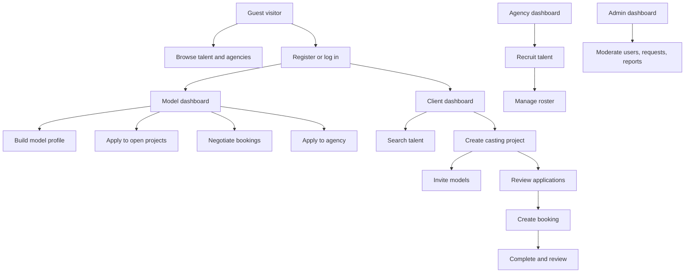

## 2. Technology Stack

Frontend framework:

- React 19.2.4 with TypeScript.
- Vite 6.x as the dev server and production builder.
- React Router DOM 7.13.0 for SPA routing. The app uses `HashRouter`, so routes are URL hash based.
- Tailwind CSS 3.4.x for styling and responsive layout.
- Lucide React for icons.
- Recharts for dashboard charts.

Backend and data layer:

- Supabase Auth for email/password authentication.
- Supabase PostgreSQL as the database.
- Supabase Realtime via `postgres_changes` channels.
- Supabase Row Level Security policies in SQL files.
- No custom Node/Express backend is present. The frontend talks directly to Supabase and Cloudinary.

Storage and media:

- Cloudinary handles profile images, galleries, agency logos, agency request photos, and payment proof images.
- Cloudinary unsigned upload presets are used for client-side upload.
- Image metadata and URLs are stored in Supabase tables.

Configuration and tooling:

- `package.json`: scripts are `npm run dev`, `npm run build`, and `npm run preview`.
- `vite.config.ts`: dev server on port 3000, React plugin, root alias `@`, Gemini env compatibility definitions.
- `tailwind.config.cjs`: brand color tokens, Inter font stack, fade/slide animations.
- `tsconfig.json`: TypeScript compiler configuration.
- `postcss.config.cjs`: Tailwind/PostCSS pipeline.
- `metadata.json`: app metadata.

Environment variables:

- `VITE_SUPABASE_URL`: Supabase project URL.
- `VITE_SUPABASE_ANON_KEY`: Supabase anonymous public key.
- `VITE_CLOUDINARY_CLOUD_NAME`: Cloudinary cloud name.
- `VITE_CLOUDINARY_UPLOAD_PRESET_PROFILE`: optional profile upload preset.
- `VITE_CLOUDINARY_UPLOAD_PRESET_GALLERY`: optional gallery upload preset.
- `VITE_CLOUDINARY_UPLOAD_PRESET_PAYMENT`: optional payment proof upload preset.

Do not store Cloudinary API secrets, Supabase service-role keys, or private API keys in Vite/client environment variables.

## 3. Folder Structure and Major Files

Root files:

- `App.tsx`: creates `ShortlistContext`, wraps providers, defines all routes, and implements `ProtectedRoute` role access. Admin route access uses both role and admin email fallback.
- `index.tsx`: React entry point that mounts the app into the DOM.
- `index.html`: Vite HTML shell.
- `index.css`: Tailwind imports, CSS variables, brand theme styling, custom animations, and global app styles.
- `types.ts`: central domain enums and TypeScript interfaces for users, models, projects, bookings, reports, agency workflows, notifications, and search filters.
- `supabase.ts`: initializes Supabase client from Vite env vars, enables token refresh, session persistence, and URL session detection.
- `supabase-schema.sql`: full intended PostgreSQL schema, indexes, functions, triggers, RLS enablement, and policies.
- `supabase-profile-settings-migration.sql`: migration for profile settings improvements such as age/display-name cooldown support.
- `supabase-agency-fix-migration.sql`: migration adding missing `agency_requests.tiktok` and `agency_requests.location` columns and location index.
- `set-admin-role.sql`: SQL script template for assigning the owner/admin role in auth metadata and public users table.
- `admin-security-policies.sql`: admin-oriented RLS helper functions and policies for existing tables.
- Existing markdown files: setup, migration, authentication, database verification, realtime/admin fix summaries. These document previous repair work and deployment notes but are not the canonical architecture source; this file is.

Folders:

- `auth/`: authentication context.
- `components/`: shared UI components plus dashboard and admin subfolders.
- `components/admin/`: admin dashboard tab content.
- `components/dashboard/`: model, client, and agency dashboard tab content.
- `config/`: project configuration constants, currently admin email config.
- `pages/`: route-level pages.
- `public/`: static assets, currently favicon.
- `services/`: Supabase service layer, Cloudinary client utilities, mock data.
- `utils/`: client-side utilities, currently image compression.

Important files by responsibility:

- `auth/AuthContext.tsx`: maps Supabase users into app users, tracks `user`, `role`, `loading`, `logout`, and `refreshRole`; fetches role from `users`.
- `components/Layout.tsx`: global navigation, role-sensitive links, shortlist badge, user dropdown, admin link visibility.
- `components/NotificationSystem.tsx`: toast notification provider and hook.
- `components/ThemeContext.tsx`: theme state and persistence.
- `components/OptimizedImage.tsx`: image rendering wrapper for Cloudinary-style optimized URLs and lazy loading.
- `components/ModelCard.tsx`: model listing card.
- `components/AgencyCard.tsx`: agency listing/ranking card.
- `components/ConfirmationModal.tsx`: reusable destructive/confirm action modal.
- `components/BookingActionModal.tsx`: booking actions such as cancel, report, review, complete, and block.
- `components/JoinAgencyModal.tsx`: model request to join an agency.
- `components/AppearanceSettings.tsx`: profile/dashboard theme preferences.
- `services/supabase.service.ts`: central application data access layer, transformations, CRUD, real-time subscriptions, and business actions.
- `services/cloudinary.ts`: Cloudinary upload and URL transformation helpers.
- `utils/imageOptimizer.ts`: canvas-based image compression to base64 for legacy upload paths.

## 4. Routes and Pages

Public routes:

| Route | Page | Purpose | Main actions |
|---|---|---|---|
| `/` | `pages/Home.tsx` | Landing and talent search | Browse models, filter talent, shortlist, navigate to profiles |
| `/register` | `pages/Register.tsx` | Login and registration | Create model/client account, log in, role redirect |
| `/profile/:id` | `pages/Profile.tsx` | Model portfolio | View photos/video, share, shortlist, contact details |
| `/agencies` | `pages/Agencies.tsx` | Agency directory | Search/filter/sort agencies, open agency profile |
| `/agency/:id` | `pages/AgencyProfile.tsx` | Agency detail | View roster/gallery, contact, request to join |
| `/casting` | `pages/CastingCall.tsx` | Project creation | Create casting call, search models, invite models |
| `/shortlist` | `pages/Shortlist.tsx` | Saved models | Review saved models, invite models to projects |
| `/help` | `pages/HelpCenter.tsx` | Help center | Expand FAQ categories |
| `/safety` | `pages/SafetyTrust.tsx` | Safety and trust | Read policies, incident CTA |
| `/contact` | `pages/Contact.tsx` | Contact page | Submit contact details or view office/contact information |

Protected routes:

| Route | Allowed role | Page | Purpose |
|---|---|---|---|
| `/dashboard` | model | `pages/Dashboard.tsx` | Model dashboard |
| `/client-dashboard` | client | `pages/ClientDashboard.tsx` | Client portal |
| `/agency-dashboard` | agency | `pages/AgencyDashboard.tsx` | Agency management |
| `/agency-registration` | model | `pages/AgencyRegistration.tsx` | Model applies to create/register agency |
| `/admin` | admin/email admin | `pages/Admin.tsx` | Platform administration |

## 5. User Roles

### Model

Capabilities:

- Register as talent.
- Create and edit model profile.
- Upload profile and portfolio images.
- Select categories, location, physical attributes, availability, bio, social/contact details, and category pricing.
- View dashboard metrics.
- Browse relevant opportunities and direct invitations.
- Apply to projects and cancel pending applications.
- Accept or decline booking offers.
- Counter-offer in booking negotiations.
- Complete bookings, submit reviews, report problems, and block users in booking context.
- Apply to join agencies, respond to agency invitations, and submit leave requests.

Permissions:

- Own user/profile updates.
- Own model media/category/pricing management.
- Own project applications and invitation responses.
- Own bookings and negotiations.
- Own notifications.

Restrictions:

- Cannot access client, agency, or admin dashboards.
- Cannot approve project applications unless also acting as client in data, which route guard prevents.
- Cannot manage other models.
- Cannot view admin queues except by database misconfiguration.

Workflow:

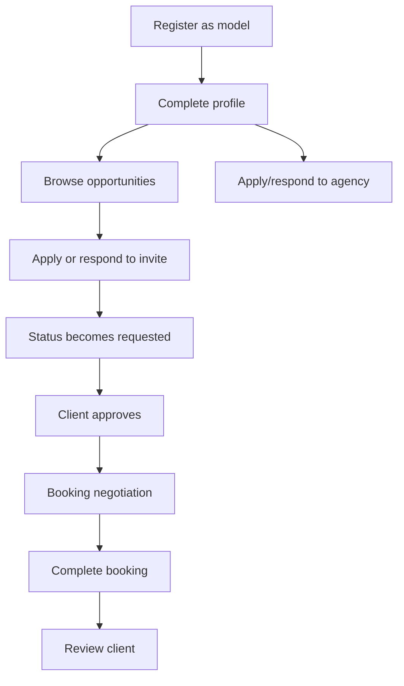

### Client

Capabilities:

- Register as client.
- Search talent and shortlist models.
- Create public/private projects.
- Invite models to projects.
- Review project applications.
- Approve models and create bookings with offer prices.
- Negotiate rates with models.
- Manage project statuses.
- Mark bookings complete, review models, report issues.

Permissions:

- Own profile/settings updates.
- Own project creation, update, deletion.
- View applications/invitations for owned projects.
- Update applications for owned projects.
- Own booking management.

Restrictions:

- Cannot edit model profiles.
- Cannot access agency roster tools.
- Cannot access admin dashboard.

Workflow:

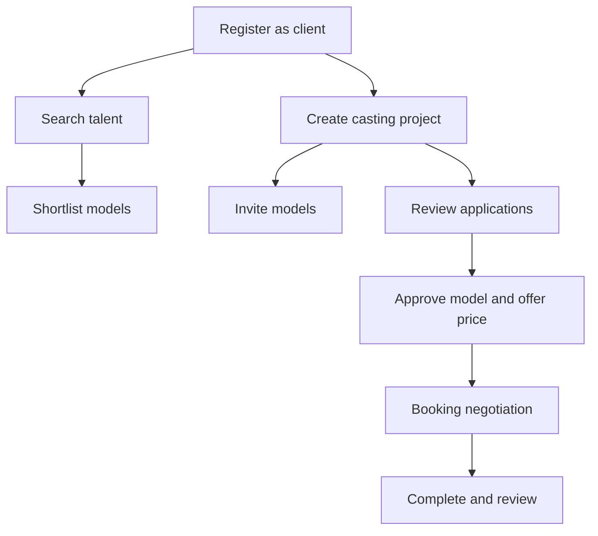

### Agency

Capabilities:

- Operate as a user with role `agency` rather than a separate `agencies` table.
- Maintain agency profile details, logo/photo, bio, gallery, social links, and contact info.
- Recruit models by searching talent and sending invitations.
- Review incoming applications from models.
- Accept/reject applications.
- Manage roster and remove models.
- View agency metrics and top performers.
- Handle leave requests depending on service path and policies.

Permissions:

- Own agency profile updates through user/galleries/custom links.
- Agency-related applications/invitations where `agency_id` is the agency user ID.
- Own roster model relationships through `models.agency_id`.

Restrictions:

- Cannot access admin dashboard.
- Cannot manage unrelated agencies/users.
- Cannot directly become agency without admin approval or database role assignment.

Workflow:

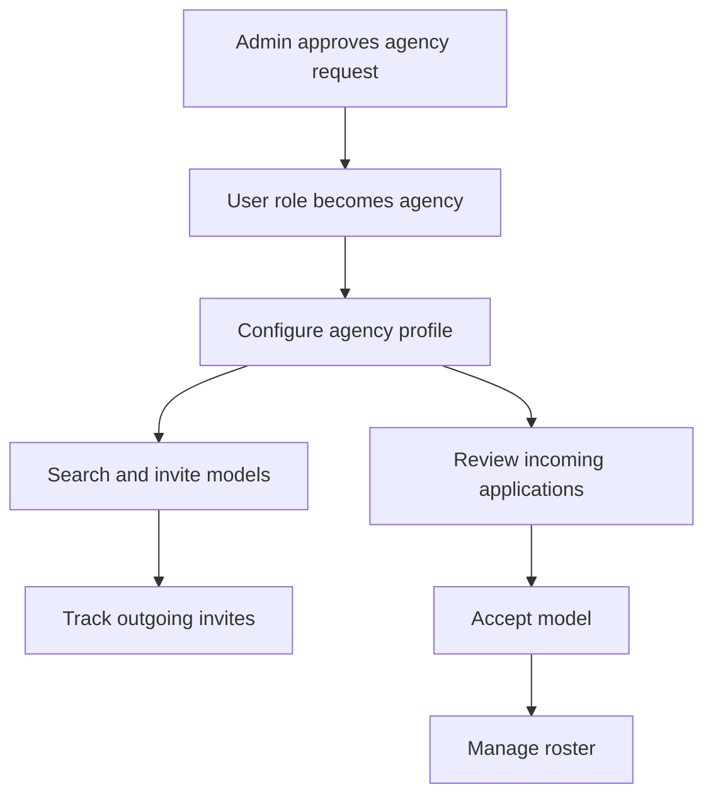

### Admin

Capabilities:

- Access admin dashboard only if authenticated user email matches admin config or role is admin.
- View all users and projects.
- Verify/unverify users.
- Block/unblock users.
- Delete users/projects.
- View agency requests and approve/reject them.
- View reports and update report status.
- Send warnings.
- View/process leave requests.

Permissions:

- Intended full platform moderation access via admin RLS functions and policies.
- `set-admin-role.sql` is a template and must be updated with the intended owner email before use.

Restrictions:

- Current admin model is a single hardcoded email, not a multi-admin role management system.
- Security depends on Supabase Auth proving the logged-in email plus database RLS being correctly enabled.

Workflow:

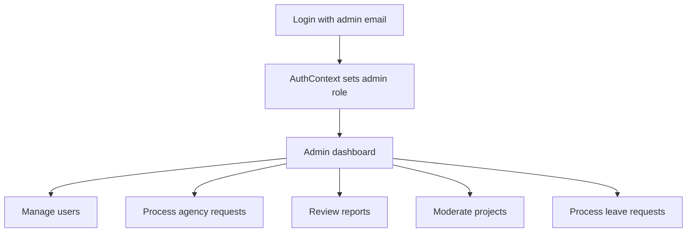

## 6. Authentication Flow

Registration:

1. User opens `/register`.
2. User selects role as model or client. Agency self-registration in the UI is not the normal direct path; agency status is handled through requests/approval.
3. User enters display name/company name, email, and password.
4. `supabase.auth.signUp()` creates auth user with metadata `{ display_name, role }`.
5. `createUserProfile()` upserts into `public.users` and creates a default `models` row when role is model.
6. Auth context refreshes the role.
7. User is redirected based on role.

Login:

1. User enters email/password on `/register` in login mode.
2. `supabase.auth.signInWithPassword()` authenticates.
3. `refreshRole()` reloads the role.
4. `getUserRole()` decides redirect path.
5. Admin users should be routed to `/admin`, but current login logic does not explicitly route fetched admin to `/admin`; the layout admin button and protected route support access.

Session management:

- `supabase.ts` enables `autoRefreshToken`, `persistSession`, and `detectSessionInUrl`.
- `AuthProvider` calls `supabase.auth.getSession()` on mount.
- `AuthProvider` subscribes to `supabase.auth.onAuthStateChange()`.
- `logout()` calls `supabase.auth.signOut()` and resets role to guest.

Password reset and email verification:

- The code handles an `Email not confirmed` login error message.
- No dedicated password reset UI/page was found.
- Email verification behavior depends on Supabase Auth project settings.

Role assignment:

- Initial role comes from registration metadata and `createUserProfile()`.
- Role is persisted in `public.users.role`.
- Admin role should be assigned through database role/admin permission records and protected by RLS.
- Agencies are users whose role becomes `agency`, typically after approval of an agency request.

Authentication diagram:

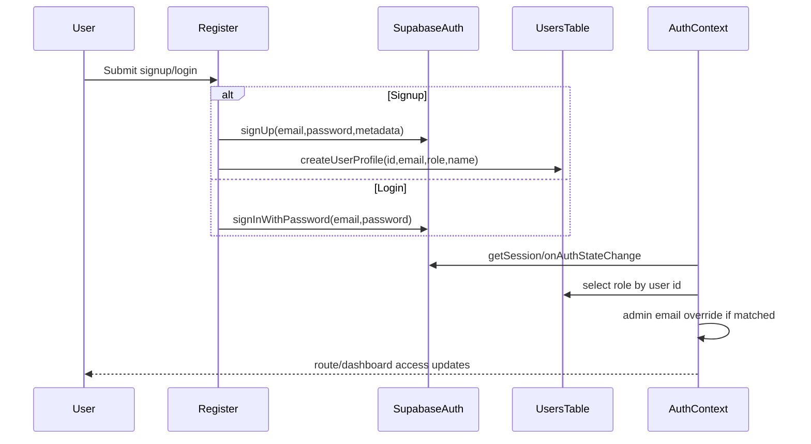

## 7. Database Documentation

The canonical schema is in `supabase-schema.sql`. The app expects 21 database tables in the main schema inventory. There is no `public.agencies` table; agencies are represented by rows in `public.users` with `role = 'agency'`, plus gallery/custom-link/profile data and model relationships.

### `users`

Purpose: base account/profile table for all roles.

Fields: `id`, `email`, `display_name`, `display_name_changed_at`, `role`, `photo_url`, `bio`, `verified`, `is_active`, contact fields, rating/stat fields, warning/deletion counts, timestamps.

Relationships: `id` references `auth.users.id`; models, projects, bookings, reviews, reports, notifications, links, and galleries reference users.

Indexes: role, email, verified partial, active partial.

Security: RLS allows active user visibility, own profile updates, own creation, and admin full access.

Validation: email format check; role check; rating bounds.

### `custom_links`

Purpose: dynamic portfolio/social links for users/agencies.

Fields: `id`, `user_id`, `platform`, `url`, `display_order`, `created_at`.

Relationships: `user_id` references users.

Index: user.

Security: expected owner management, public or profile-related reads depending policy.

### `gallery_images`

Purpose: profile/agency gallery images.

Fields: `id`, `user_id`, `cloudinary_url`, `cloudinary_public_id`, `display_order`, `uploaded_at`.

Relationships: `user_id` references users.

Index: user.

Security: owner management.

### `models`

Purpose: model-specific profile extension.

Fields: physical attributes, location, agency relationship, availability, profile image, video reel, views, ranking score, timestamps.

Relationships: `id` references users; `agency_id` references users.

Indexes: agency, availability, district, gender, age, ranking.

Security: public read, own updates/create, admin full access.

Validation: age range, height range, gender and skin tone checks.

### `model_images`

Purpose: model portfolio image list.

Fields: `id`, `model_id`, `cloudinary_url`, `cloudinary_public_id`, `display_order`, `uploaded_at`.

Relationships: `model_id` references models.

Index: model.

Security: public read, own model management.

### `model_categories`

Purpose: many-to-many model categories.

Fields: `model_id`, `category`.

Relationships: `model_id` references models.

Index: category.

Security: public read, own model management.

Validation: category check in schema may not perfectly match `types.ts` category enum; this must be kept aligned.

### `model_pricing`

Purpose: per-category rate cards.

Fields: `model_id`, `category`, `price`, `currency`.

Relationships: `model_id` references models.

Index: category.

Security: public read, own model management.

Validation: non-negative price.

### `projects`

Purpose: client/agency casting projects.

Fields: owner fields, title, description, category, location, date strings, `event_date`, `status`, `visibility`, timestamps.

Relationships: owner references users; applications, invitations, and bookings reference projects.

Indexes: owner, status, category, location, event date, created date.

Security: public can view open/public projects; owners can view/update/delete own; clients can create; admins full access.

### `project_applications`

Purpose: models applying to projects.

Fields: `id`, `project_id`, `model_id`, `status`, `applied_at`.

Relationships: project and model references.

Indexes: project, model, status.

Validation: unique project/model pair; status enum.

Security: models view own, owners view applications, models insert, owners update.

### `project_invitations`

Purpose: project owners inviting models.

Fields: `id`, `project_id`, `model_id`, `status`, `invited_at`, `responded_at`.

Relationships: project and model references.

Indexes: project, model, status.

Validation: unique project/model pair; status enum.

Security: models view/respond to own invites; owners view/create sent invites.

### `bookings`

Purpose: booking lifecycle, negotiation summary, payment proof and review references.

Fields: project/model/client identifiers and denormalized names, status, current offer fields, payment proof URL, review IDs, timestamps.

Relationships: project, model, client, and reviews.

Indexes: model, client, project, status, updated.

Validation: status enum and unique project/model pair.

Security: participants view/update; clients create; admins full access.

### `booking_negotiations`

Purpose: offer history for a booking.

Fields: `id`, `booking_id`, `role`, `amount`, `note`, `created_at`.

Relationships: booking reference.

Indexes: booking, created date.

Security: booking participants view/create.

### `booking_hidden_by`

Purpose: per-user archive/hidden state for bookings.

Fields: `booking_id`, `user_id`, `hidden_at`.

Relationships: booking and user.

Index: booking.

Security: intended participant-only use.

### `reviews`

Purpose: post-booking ratings and comments.

Fields: `id`, `booking_id`, `author_id`, `target_id`, `target_role`, `rating`, `comment`, `created_at`.

Relationships: booking and users.

Indexes: target, booking, created.

Validation: unique booking/author; rating 1-5.

Security: public read, participants create/update own reviews.

### `reports`

Purpose: user reports for moderation.

Fields: reporter/reported IDs and roles, reason, details, status, timestamps.

Relationships: users.

Indexes: reported user, status, created.

Security: users view own reports/create; admins view/update all.

### `notifications`

Purpose: in-app notifications and warnings.

Fields: `id`, `user_id`, `type`, `title`, `message`, `link`, `read`, `created_at`.

Relationships: user reference.

Indexes: user, unread partial, created.

Security: users view/update/delete own; system/admin insert depending policies.

### `agency_requests`

Purpose: model request to create/register an agency.

Fields: applicant data, agency name, logo URL, WhatsApp, social links, TikTok, website, location, member counts, bio, status, timestamps.

Relationships: applicant references users.

Indexes: applicant, status, location.

Security: users view own, models create, admins view/update all.

### `agency_request_photos`

Purpose: model photos submitted with agency registration request.

Fields: `id`, `request_id`, `cloudinary_url`, `cloudinary_public_id`, `display_order`.

Relationships: request reference.

Index: request.

Security: tied to agency request ownership/admin.

### `agency_applications`

Purpose: models applying to existing agencies.

Fields: model/agency IDs, model snapshot, note, status, timestamps.

Relationships: users/models.

Indexes: model, agency, status.

Validation: unique model/agency.

Security: models view/create own; agencies view/respond to incoming.

### `agency_invitations`

Purpose: agencies inviting models.

Fields: agency ID/name, model ID, status, timestamps.

Relationships: users/models.

Indexes: model, agency, status.

Validation: unique agency/model.

Security: models view/respond; agencies view/create sent invites.

### `leave_requests`

Purpose: models requesting to leave agencies.

Fields: model/agency IDs and names, reason, status, timestamps.

Relationships: users/models.

Indexes: model, agency, status.

Security: models create/view own; agencies/admins view; admins process.

Database functions/triggers:

- `update_updated_at_column()`: maintains `updated_at` on updated tables.
- `update_user_rating()`: recalculates ratings when reviews change.
- `search_models(...)`: database-side search helper.
- `is_admin()`: checks user role for RLS.
- `get_my_role()`: role lookup helper.
- `handle_new_user()`: creates public user profile from auth signup.
- Admin helper functions in `admin-security-policies.sql`: `public.is_admin()` and `public.is_admin_email()`.

## 8. Frontend Documentation

Global layout:

- `Layout.tsx` shows logo, public links, client-only project links, talent dashboard link, shortlist badge, login/signup, user dropdown, logout button, mobile hamburger, and admin button for admin email/role.
- Logo destination changes for talent users.
- Route changes close mobile menu and scroll to top.

Home page:

- Loads/searches models through `subscribeToSearchModels`.
- Guests see limited/top model discovery behavior.
- Authenticated users can search/filter more broadly.
- User actions: view profile, shortlist, adjust filters.

Register page:

- Buttons: role selection for talent/client, submit sign up/log in, mode toggle.
- Form fields: full/company name for signup, email, password.
- API calls: Supabase Auth signup/login, `createUserProfile`, `refreshRole`, `getUserRole`.
- Validation: name required for signup, password min length, email input type.

Profile page:

- Loads model profile by ID.
- Tracks model views.
- Shows gallery, profile information, social/contact links, pricing/categories, agency info, and actions like share/shortlist.

Agencies page:

- Loads agencies via `getAgencies()` and related model metrics.
- Supports filtering/sorting/ranking of agencies.
- Navigates to agency profile.

Agency profile page:

- Loads agency user data and agency models.
- Shows gallery, roster, contact links, social links.
- Model users can open `JoinAgencyModal` to apply.

Casting call page:

- Form buttons: create/submit project, search/invite selected models, next/back step buttons.
- Data: project details, model search results, selected invitation targets.
- API calls: `createProject`, model search subscription, `inviteModelToProject`.

Shortlist page:

- Uses global in-memory `ShortlistContext`.
- Shows saved models; clients can invite shortlisted models to projects depending available project state.
- Limitation: shortlist is not persisted to database.

Model dashboard:

- `ModelOverview`: KPI cards, chart, agency status, agency actions.
- `ModelProfileSettings`: multi-section profile form, image upload/delete, category selection, pricing, availability toggle, contact fields, theme settings.
- `ModelOpportunitiesView`: open projects and project invites, apply, requested status, cancel application, decline invitation, real-time updates.
- `ModelBookingsView`: booking list/history, filters/sorting, negotiation actions, complete/review/report/block/cancel/archive/delete depending state.

Client dashboard:

- `ClientOverview`: project/booking/spend stats and recent activity.
- `ClientProjectsView`: project CRUD, application review, offer entry, approve/reject model, delete/edit project.
- `ClientBookingsView`: booking offers, negotiation, complete, review, report, dispute/cancel actions.
- `ClientProfileSettings`: client/company profile settings.

Agency dashboard:

- `AgencyOverview`: roster counts, total views, available models, top performers.
- `AgencyRecruitTalent`: model search, filter, invite to agency.
- `AgencyApplications`: incoming applications, approve/reject, fee/terms entry where applicable.
- `AgencyModelManagement`: roster list and remove/manage model actions.
- `AgencyProfileSettings`: agency profile, gallery, contact/social links.

Admin dashboard:

- `AdminOverview`: aggregate cards for users/projects/agencies/requests.
- `AdminUsers`: user table, search/filter, verify/unverify, block/unblock, delete user.
- `AdminProjects`: project list, delete project.
- `AdminRequests`: agency requests, details/photo/social data, approve/reject.
- `AdminReports`: reports list, review, warn, block, resolve.
- `AdminLeaveRequests`: leave request processing.
- All destructive admin actions use `ConfirmationModal`.

## 9. Backend/Service Documentation

There are no traditional HTTP API routes in this repository. Backend behavior is implemented through Supabase client calls and Cloudinary upload requests from the frontend.

### User services

- `createUserProfile(uid,email,role,displayName?)`: upserts public user and creates model row for model role.
- `getUserRole(uid)`: returns role for redirects and auth context.
- `getUserData(uid)`: gets transformed user data with extras.
- `subscribeToUser(uid, callback)`: real-time user row listener.
- `getAllUsers()`: admin list users.
- `updateUserData(uid, updates)`: updates user profile/contact/social fields.
- `toggleUserVerification(uid, verified)`: admin verification.
- `toggleUserStatus(uid, isActive)`: admin active/block state.
- `deleteUserPermanently(uid)`: hard delete user and cascaded data.
- `sendAdminWarning(userId,message)`: increments warning count and creates notification.

### Model services

- `getModelProfile(uid)`: model profile with user/category/pricing/media data.
- `subscribeToSearchModels(filters, callback)`: real-time search feed.
- `subscribeToAgencyModels(agencyId, callback)`: real-time roster feed.
- `getAgencyModels(agencyId)`: one-shot roster fetch.
- `updateModelProfile(uid, updates)`: updates user, model, category, pricing, and image tables.
- `incrementModelViews(uid)`: increments view counter.
- `removeModelFromAgency(modelId)`: clears agency relationship.

### Agency services

- `getAgencies()`: users where role is agency.
- `submitAgencyRequest(request)`: creates agency request and photos.
- `subscribeToAgencyRequests(callback)`: admin request queue.
- `approveAgencyRequest(requestOrId)`: marks request approved, updates applicant role to agency, sends notification.
- `rejectAgencyRequest(requestId)`: rejects and notifies applicant.
- `applyToJoinAgency(modelId, agencyId, note)`: model agency application.
- `respondToAgencyApplication(...)`: agency accepts/rejects model application.
- `inviteModelToAgency(agencyId, agencyName, modelId)`: agency invitation.
- `respondToAgencyInvitation(...)`: model invitation response.
- `subscribeToAgencyInvitations`, `subscribeToAgencyOutgoingInvites`, `subscribeToAgencyIncomingApplications`: realtime agency queues.
- `submitLeaveRequest`, `subscribeToLeaveRequests`, `processLeaveRequest`: leave workflow.

### Project services

- `createProject(project)`: creates project and returns ID.
- `getProjectById(projectId)`: project detail.
- `subscribeToProjects(callback)`: public open project feed.
- `subscribeToClientProjects(clientId, callback)`: owner projects with app/invite updates.
- `subscribeToOpenProjectsByCategories(categories, callback)`: model opportunity feed.
- `getAllProjectsAdmin()`: admin list.
- `updateProject(projectId, updates)`: update project.
- `deleteProject(projectId)`: delete project.
- `applyToProject(projectId, modelId)`: create pending application and notify owner.
- `cancelProjectApplication(projectId, modelId)`: delete pending application.
- `approveModelApplication(projectId, modelId, approvals?, offerPrice)`: approve application and create booking.
- `inviteModelToProject(projectId, modelId)`: create invitation and notify model.
- `declineProjectInvite`, `subscribeToProjectInvites`, `subscribeToAcceptedProjects`, `updateProjectStatus` handle invite/status extensions.

### Booking services

- `subscribeToBookings(userId, role, callback)`: realtime booking feed for model/client/admin context.
- `updateBookingStatus(bookingId,status,amount?,role)`: status/current offer updates.
- `updateBookingOffer(bookingId, offer)`: negotiation history and current offer.
- `uploadPaymentProof(bookingId,imageBase64)`: Cloudinary upload and booking update.
- `completeBooking(bookingId)`: mark complete.
- `cancelBookingWithReason(bookingId,reason,userId)`: cancellation flow.
- `archiveBooking(bookingId,userId)`: hidden-by entry.
- `deleteBooking(bookingId)`: hard delete.
- `acceptPreviousOffer(bookingId, role)`: accept existing counteroffer.
- `blockBookingUser(bookingId, blockerId, blockedId)`: blocking/archive behavior.

### Review/report/notification services

- `submitReview(...)`: review creation and rating recalculation.
- `submitReport(...)`: report creation.
- `subscribeToReports(callback)`: admin reports queue.
- `updateReportStatus(reportId,status)`: moderation status update.
- `createNotification(notification)`: create notification.
- `subscribeToNotifications(userId, callback)`: realtime notifications.
- `markNotificationRead`, `markAllNotificationsRead`, `deleteNotification`: notification state management.
- `cleanupOldNotifications()`: maintenance helper.

### Cloudinary services

- `uploadImage(file,type,optimizeFirst?)`: uploads single image with preset by type.
- `uploadImages(files,type)`: batch upload.
- `deleteImage(publicId)`: documented as requiring backend/Admin API, not safely available in frontend-only app.
- `getPublicIdFromUrl(url)`: parse Cloudinary public ID.
- `getOptimizedUrl(url,width?,height?)`: construct transformed Cloudinary URL.
- `compressImage(file,maxSizeKB)`: canvas compression.

## 10. Business Logic Flow Maps

Project posting:

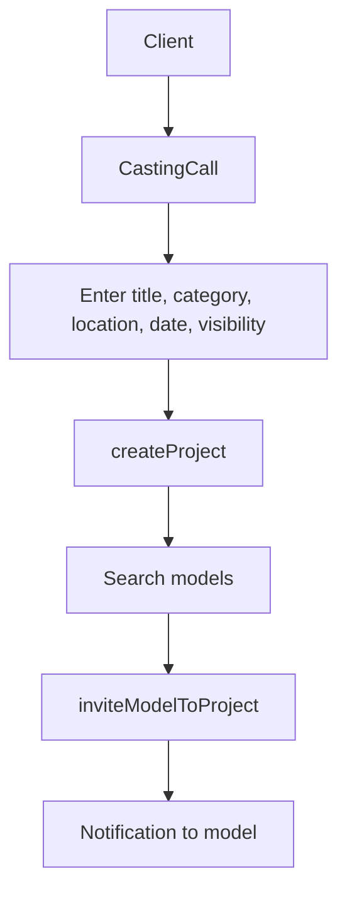

Application:

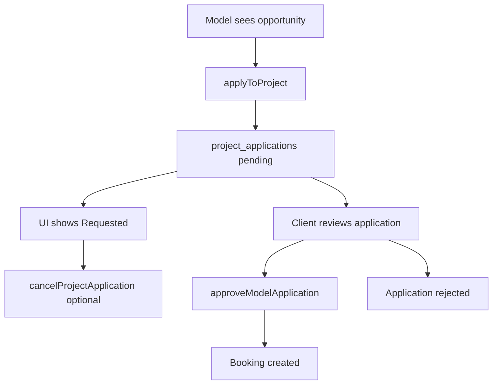

Booking and negotiation:

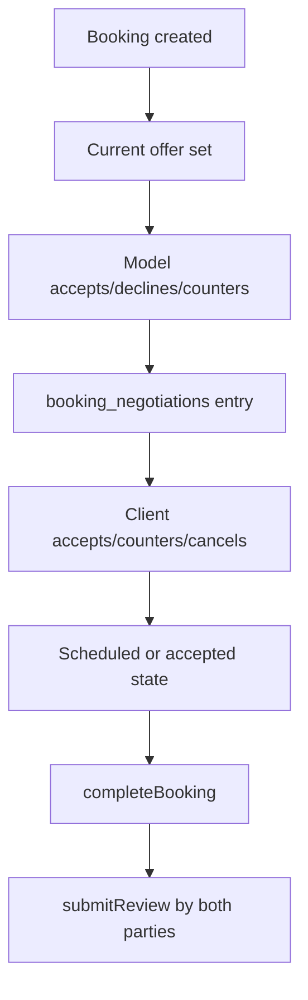

Agency workflow:

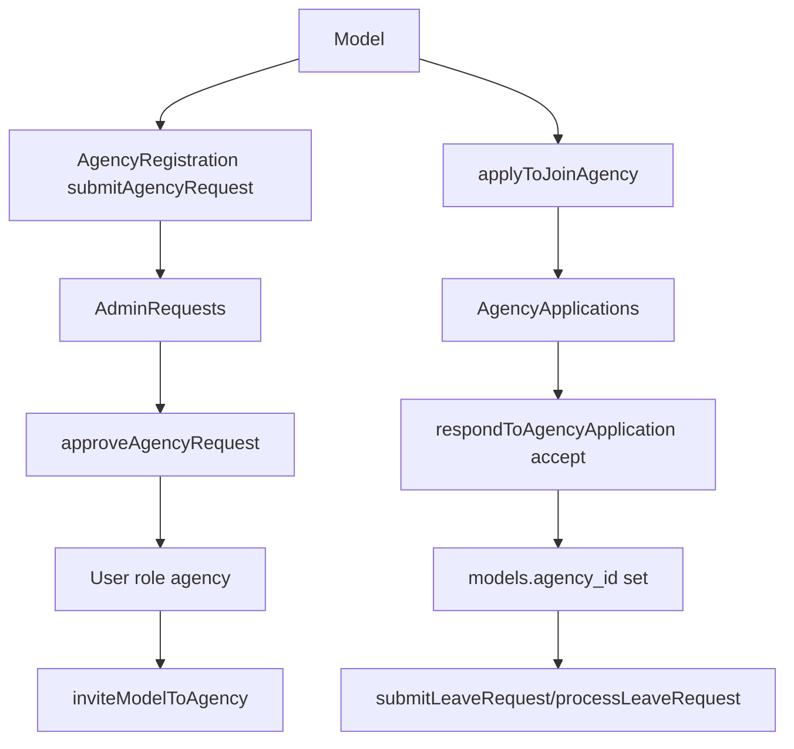

Reporting/moderation:

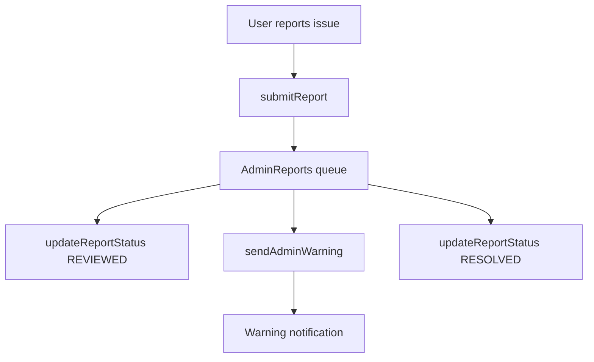

## 11. API Documentation

The app has no internal HTTP endpoints. The effective API surface is:

- Supabase Auth: `signUp`, `signInWithPassword`, `signOut`, `getSession`, `getUser`, `onAuthStateChange`.
- Supabase PostgREST: table CRUD via `.from(table).select/insert/update/upsert/delete`.
- Supabase Realtime: `.channel(...).on('postgres_changes', ...)`.
- Cloudinary unsigned upload endpoint: `https://api.cloudinary.com/v1_1/{cloudName}/image/upload`.

Payload and response rules:

- Service functions transform frontend camelCase objects to database snake_case payloads and back.
- Errors are thrown for many mutation failures and surfaced as toasts/alerts in UI.
- Missing-column compatibility exists for some recent migrations, especially agency request fields and profile settings.
- Realtime subscriptions always return an unsubscribe function and should be cleaned up in component `useEffect` cleanup.

## 12. Security Documentation

Authentication security:

- Supabase Auth manages passwords, sessions, token refresh, and identity.
- The frontend should never store service role keys.
- Supabase anonymous key is public and must be constrained by RLS policies.

Authorization security:

- `ProtectedRoute` restricts dashboard routes by `UserRole`.
- Admin route permits users whose database role resolves to `admin`.
- Components check roles before showing role-specific actions.
- Database RLS is the real security boundary; frontend checks are UX and defense-in-depth, not sufficient alone.

Database security:

- `supabase-schema.sql` enables RLS on all core tables.
- RLS policies cover owner access, participants, clients, models, agencies, and admins.
- `admin-security-policies.sql` adds admin helper policies for existing tables.
- A previous error occurred because `public.agencies` does not exist; agency policies must target `users` with `role='agency'` and related agency workflow tables.

Storage security:

- Cloudinary unsigned presets allow direct client upload. Presets must restrict file types, maximum size, folders, and transformations in Cloudinary dashboard.
- Deletion requires a backend or signed Cloudinary Admin API call; it is not safe to expose API secret in frontend.
- Payment proof uploads need moderation/validation policies.

Admin protection:

- Admin ownership is managed in SQL/admin permission records, not frontend source.
- The current design is single-admin and email based.
- A more mature design would store admin users/permissions in a dedicated table with MFA and audit logs.

User protection:

- Display name cooldown reduces impersonation churn.
- Reports and warnings support moderation.
- Blocking/archiving exists in booking context.
- Account deletion/leave flows exist, but hard deletion can destroy evidence and should be revisited.

## 13. Known Limitations and Implementation Notes

- There is no custom backend for privileged operations, so admin actions rely on Supabase RLS and client-side service calls.
- There is no separate `agencies` table; do not write policies or queries against it unless one is added.
- Shortlist is in-memory and not persisted.
- Password reset UI is missing.
- Payment handling is only proof upload/status tracking; there is no real escrow/payment processor.
- Messaging is notification/booking-negotiation based, not a full chat system.
- Some docs in the repository predate recent fixes and should be treated as historical unless updated.
- Production deployment must ensure all SQL migrations and RLS policies are applied in Supabase.
